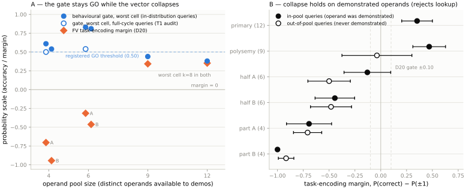

# A function vector can pass the accuracy gate, reliability, and causal-effect checks — and encode a different function

*Second in a sequence on interpretability instruments failing quietly. Previous
post: a probe error masquerading as a model error. This post: the validation
gate itself.*

**TL;DR**

- A function vector extracted from 16-shot demonstrations restricted to 4 of 12
  months passes every check standard practice applies: behavioural gate GO at
  every k (worst cell 0.50, scored on the full query cycle), split-half cosine
  ≥ 0.99, large causal effect.
- It encodes **next-item, not shift-by-k**. Task-identity margin runs −0.31 to
  −0.94 across four restricted conditions against **+0.35** for the full-pool
  vector, and reaches **−1.00** at the worst cell — on the demonstrated
  operands themselves.
- Across these six conditions the gate **anti-correlates** with what the vector
  encodes: the four collapsed vectors have the highest gate worst-cells
  (0.54–0.83), the two healthy ones the lowest (0.38 and 0.44). All four
  collapsed conditions pass unqualified; both healthy ones needed our
  registered weak-cell branch.
- The driver is **operand diversity, not shot count**: 16 shots from a 4-month
  pool contain ~3 distinct operands, and below a threshold between 9 and 6 pool
  operands the vector snaps to the family's degenerate default. That default is
  not noise — `next_item` is itself a named task in Todd et al.'s own benchmark
  suite, so the collapsed vector returns a different catalogue task.
- We killed our own second headline on a pre-committed test (median real-floor /
  fixture-floor ratio: ≥10 generalises, <3 kills it). **It returned 0.79.**
  What survives is worse for current practice: fixture-grade nulls mis-state
  real false-positive floors in *both* directions, 0.01× to 156×.

*Draft for LessWrong / Alignment Forum. All numbers from preregistered runs on
saved artifacts; repo link at the end. Citation badges: [VERIFIED] = checked
against the paper; [UNVERIFIED] = search-snippet lead, will be read before
this posts.*

**Epistemic status:** preregistered before each run (branches committed in
advance, decision log append-only, D1–D46); one model (Llama-3.2-3B), one task
family (shift-by-k on months, Z/12) plus two reference families; one prompt
format. Generality to standard FV benchmark tasks is registered (T7) and not
yet run. We report one result below that killed our own pre-registered
headline, because that is how the method is supposed to work.

---

## The finding

Take Todd-style function vectors (causal-head averaging) for shift-by-k on
months: `Q: March\nA: June` for k = 3. Extract them from prompts whose
demonstration operands are restricted to a subset of the cycle — 4 or 6 months
out of 12 — exactly the kind of restriction any operand-partition control or
closed benchmark task produces. Then run the three validation checks standard
practice applies:

- **Behavioural gate** (the Todd et al. protocol: extract only from tasks the
  model performs): held-out 16-shot ICL accuracy, **GO at every k** — and not
  just on in-distribution queries: on the **full 12-month query cycle**,
  including operands never seen in the demonstrations, the worst cell is 0.50
  and the 6-operand run's worst cell is 0.54, *above* the full-pool run's own
  0.38 at the same cell.
- **Reliability**: split-half cosine of the extracted vector ≥ 0.99.
- **Causal effect**: injection moves zero-shot predictions massively.

Every check passes. **The vector encodes next-item, not shift-by-k.** Injected
into zero-shot prompts and scored over the full cycle, P(prediction lands on
the correct shift) − P(prediction lands on shift ±1) runs **−0.31 to −0.94**
across the four restricted conditions (it is +0.35 for the full-pool vector).
At the worst cell the collapse is total: **every** in-pool mid-cycle
prediction lands on the adjacent month (margin −1.00).

Gate columns give each condition's **worst held-out cell across the twelve
shifts** — numbers rather than GO/MARGINAL labels, since labels are threshold-
and device-dependent and the numbers are the finding:

| demo pool | gate worst cell, in-dist queries | worst cell, full-cycle queries | FV margin |
|---|---|---|---|
| 12 months | 0.38 | = in-dist (queries are the full pool) | **+0.35** |
| 9 months | 0.44 | — | **+0.34** |
| 6 months (Jan–Jun) | 0.83 | 0.54 | **−0.31** |
| 6 months (Jul–Dec) | 0.81 | — | **−0.46** |
| 4 months (Jan–Apr) | 0.61 | 0.50 | **−0.70** |
| 4 months (Sep–Dec) | 0.54 | — | **−0.94** |

The verdict, under the Todd protocol's own gating rule: **all four collapsed
conditions pass unqualified, while both healthy conditions needed the
registered weak-cell branch.** That branch (D1, committed before extraction)
permits extraction when a single cell sits below the 0.50 GO threshold but
above the 0.30 NO-GO floor, with the cell flagged and every downstream
diagnostic run both with and without it — that is how the full pool's 0.38 at
k=8 counted as a pass, and the polysemy pool's 0.44 at the same cell falls
under the same rule (D45/D46 record how that number replaced an unbacked "GO"
in our own log). The gate's only hesitations, across six conditions, landed on
the two vectors that were fine.

**Figure 1. The gate carries no information about what the vector encodes —
across these six conditions it anti-correlates.** (A) The four collapsed
vectors have the *highest* gate worst-cells (0.54–0.83); the two healthy ones
the lowest (0.38, 0.44, both at k=8, the family's hardest shift). Hollow
points re-score the gate on full-cycle queries (the T1 audit), closing the
support-mismatch objection. (B) The collapse holds on the demonstrated
operands themselves (part B in-pool margin: −1.00), which rejects the reading
that the model merely solved the restricted task by lookup and the vector
faithfully reports that; the healthy polysemy vector meanwhile splits +0.47 on
exposed operands vs −0.04 on unexposed ones. Every plotted number is asserted
in code against its source artifact (`tarcle/post_figure.py`).

The part that closes the obvious objection: maybe the gate passed only because
it was scored on easy in-distribution queries? We ran the missing cell of that
2×2 (restricted demonstrations × full-cycle queries) with branches
pre-committed before launch. The model **genuinely generalises**
restricted-demonstration shift-by-k to operands it never saw demonstrated —
out-of-pool accuracy is mostly 0.5–1.0. The competence the gate certifies is
real, on the very query support the FV margin is scored over. And the vector
extracted from those same prompts steers to next-item **even on the
demonstrated operands** (in-pool margins −0.13 to −1.00). The failure is in
the extraction, not the behaviour — which is why **no accuracy gate, at any
query support, could detect it — and no injection tuning could rescue it**:
the registered T2 sweep (28 layers × 5 scales, both methods, run to
completion) found **no grid cell with a positive task-encoding margin
anywhere** — 0 of 560 Todd cells and 0 of 112 Hendel cells; the best cell in
the whole space is exactly 0.000 (D54).

## Mechanism, as far as we measured it

The driver is **operand diversity of the demonstration distribution**, a
property accuracy does not see. Sixteen shots drawn from a 4-month pool
contain ~3 distinct operands; the in-context task gets *easier* (fewer
candidates, better coverage — k=8 accuracy rises from 0.38 to 0.87 as the pool
shrinks) while the identification of the function gets *worse*, and below a
threshold between 9 and 6 distinct operands the extracted vector snaps to the
family's degenerate default (the adjacency prior). That default is not a
degradation into noise: `next_item` and `prev_item` are named benchmark tasks
in Todd et al.'s own task suite, so the collapsed vector returns a *different
task from the same catalogue* — which is why it looks so healthy on every
measure that scores vectors rather than functions. The failure is **silent**:
the collapsed vector is well-formed, maximally reliable, causally potent.

And it is a **bias** phenomenon, not a variance one — stable across prompt
draws, systematically the wrong function; more samples of the same restricted
distribution cannot fix it. *From Compression to Expansion* [VERIFIED: arXiv
2505.17322] gives this a formal home, and a sharper one than we expected: their
Theorem 5.1 proves that the bias *and* the variance of the task vector both
decay O(1/K) in the number of demonstrations K — **under i.i.d. demonstrations
drawn from the task distribution** — and their Appendix E shows the guarantee
breaking when the demonstration distribution is degenerate (their repeat mode).
Restricting the operand pool changes the demonstration distribution itself, so
the convergence result still holds and simply points somewhere else: extraction
converges at O(1/K) to the *wrong* limit. More shots converge faster to the
wrong vector.

## What to do instead

- **Report operand diversity alongside shot count** whenever an extraction is
  reported. "16-shot" hides the variable that mattered here; distinct operands
  per prompt is one number and it is free.
- **Keep demonstrations above the collapse threshold.** On this family it sits
  between 9 and 6 distinct pool operands (≈7 vs ≈5 distinct per 16-shot
  prompt). That interval is measured at two points on one family — treat it as
  a warning zone to stay above, not a constant of nature.
- **Validate the vector against a task-identity readout, not task accuracy**:
  record the argmax of each injected zero-shot prediction and compare
  P(correct function) against the family's degenerate default (here the
  adjacent item; in general, whatever the model does with no task signal). It
  costs nothing beyond the efficacy scoring a causal validation already runs
  (`tarcle/nextitem.py`).
- **What our own runs did:** none of these, until a transfer control failed
  strangely and forced them (D19/D20). The original pilot gated on accuracy
  alone, exactly as the protocol prescribes — which is the point.

## Why existing checks don't cover this

- **Hendel et al. 2023 §4** [VERIFIED] ran the robustness check this genre
  relies on: 50 task vectors per task over varied demonstration sets and dummy
  queries, clean per-task t-SNE clusters, conclusion: robust. The varied sets
  were drawn from **full operand pools**. Restrict the pool and every
  consistency measure still passes — consistency certifies the stability of
  whatever got encoded, not its identity.
- **Makelov, Lange & Nanda 2024** [VERIFIED] named the patching version of
  this genre: intended causal effect via a dormant parallel pathway. Ours is
  the **extraction analogue** — passing validation, large effect, wrong
  object — with a different mechanism (distribution-induced bias) and a
  different artifact (the vector itself).
- **Tan et al. 2024** [VERIFIED] documented steering vectors that fail to
  steer — an **efficacy** axis. Ours steer perfectly and lie about what they
  steer toward — a **faithfulness** axis. A reliability metric scores our
  failure as success.
- A May 2026 position paper [VERIFIED: arXiv 2605.08012] names the general
  pattern "validation metric substitution" and calls for identification
  assumptions to be disclosed. We read our result as a preregistered empirical
  instance of exactly that failure, in the most standard extraction protocol
  in the FV literature — the paper is a position piece and carries no
  preregistered empirical instance of its own.

Concretely, that paper's Table 4 pairs each method with the validation metric
it typically reports and the identification assumption that metric leaves
untested, for four methods: activation patching, SAE steering, causal
abstraction, and probing-plus-ablation. **FV extraction is absent from the
table, and this post is the missing fifth row.** Method: FV extraction from ICL
demonstrations. Validation metric typically reported: behavioural accuracy gate,
plus reliability, plus causal effect. Identification assumption left untested:
**demonstration-distribution sufficiency** — that the demonstration
distribution identifies the intended function. Why the metric cannot test it:
the model can perform the task on any query support, while the extraction
inherits that distribution's degenerate default; competence and identification
come apart, and the accuracy gate only ever sees the first.

## We killed our own second headline, and you should trust the rest more for it

We also claimed (from an earlier failure, D37): *estimators validated on
synthetic fixtures have false-positive floors ~100× higher on real
activations.* We pre-committed a test — median ratio of real-data floor to
fixture floor across eight diagnostics, ≥10 generalises, <3 kills it — and
built the full table (300 draws per cell, validation gate first).

**The test returned 0.79. The blanket claim is dead.** What the table actually
shows is less quotable and more useful:

| statistic | fixture floor | real floor | ratio |
|---|---|---|---|
| harmonic partial R² | 0.0019 | 0.28–0.30 | **145–156×** |
| circulant score (raw) | 0.019 | 0.09–0.11 | 4.5–6× |
| permutation z | 1.90 | 2.15–2.18 | **1.1×** |
| toeplitz score | 0.65 | 0.14–0.16 | **0.2×** |
| seam cyclic cv-R² | 0.41 | ~0.004 | **~0.01×** |

Fixture-grade validation mis-states real false-positive floors **in both
directions** — understated 150-fold for one statistic (that one cost us a
wasted experiment, D37), *overstated* up to 100-fold for another (which
silently destroys power instead), and the direction is not predictable from
the statistic's form. Matching the surrogate's second moments to the data
closes most of the gap (the harmonic ratio drops from ~145× to 2×) but still
leaves errors of up to ~50× in the overstatement direction. The only row that
transfers at ratio ≈ 1 is the one whose null is generated from the data
itself. Data-derived nulls are boring, mature practice in genomics and
neuroimaging (permutation inference; the *Cluster failure* result is the same
audit for fMRI [UNVERIFIED: Eklund, Nichols & Knutsson, PNAS 2016]); mech
interp validation mostly doesn't use them. Import the
discipline; it is cheaper than the fixtures it replaces. Two objections we
raise against ourselves — including that our best transfer row is VOID under
our own validation gate, and why the ratio is still readable — are labelled in
the findings doc rather than smoothed over.

## It happened to us while writing this post

The figure above is generated by code that asserts every plotted number
against a fresh recomputation from saved activations, and building it exposed
two defects in our own records: the append-only decision log had recorded a
gate verdict (polysemy, "GO") for which no artifact was ever committed, and a
fixed-filename writer had silently overwritten the artifact our findings note
pointed at, four separate times across the project's history. Regenerating
everything from source reproduced all six margins exactly — and contradicted
the one unbacked gate verdict: the re-run is MARGINAL, 0.44 at k=8, the
family's registered weak cell, with a 24-cell cross-device check ruling out a
precision explanation (D45, D46). The correction lands on a healthy condition
and sharpens the table's contrast rather than weakening it; it was found only
because a number was rebuilt from source instead of read from a cached
artifact.

## One more measurement: the checks don't even correlate

Across the eleven performable shifts, with attenuation ceilings computed from
each measure's own noise before reading any correlation: held-out accuracy
and causal AIE agree (ρ = 0.91–0.98). **Injection efficacy — the other half of
the standard "task is performable + vector steers" validation pair — is
statistically unrelated to accuracy across tasks: ρ = 0.02 against a noise
ceiling of 0.93.** Two readouts of the *same* injections (argmax accuracy vs
mean log-probability lift) correlate at ρ = 0.12. Prior work has shown
patching results are sensitive to metric and method choices [VERIFIED:
2309.16042, 2407.08734]; the narrow thing we add is that the two measures the
FV literature *composes into a single argument* are unrelated across tasks
within a family.

## Alignment relevance

Causal efficacy is not semantic faithfulness. Every deployment story for
activation steering — as a control primitive, as a monitoring probe, as a
"we checked the model with a task vector" audit — gates on some combination of
behavioural validation, reliability, and effect size. The object this post
exhibits passes all three while implementing a function other than its label,
and it arises from an ordinary, innocent-looking property of the data used to
build it. If steering vectors become control or monitoring infrastructure, a
reliable, high-effect, mislabelled vector is the failure class that matters:
nothing in the deployment gate fires, and the intervention does something
adjacent to — but not — what its name says.

## Scope, and what would change our minds

One model, one cyclic task family (plus add-k and twelve unrelated tasks as
references), one prompt format, Todd-style extraction for the headline (the
Hendel-style dummy-query extraction cannot steer mid-cycle shifts at all on
this model — a registered limitation reported throughout). The degenerate
default here is the adjacency prior; the general claim is that accuracy-gating
misses *some* degenerate default, not that it is always next-item. Two
registered follow-up will test the load-bearing generalisation
(`docs/preregistration_t7.md`): **T7**, the same audit on a standard FV
benchmark task with a closed operand set — if margins hold up there, claim A
narrows to shift-like families and we will say so. **T2 has now run** (its
registration unchanged; instrument validated first, D50–D53): the
per-condition injection sweep closed the protocol objection as above, with
one scope line — the sweep covers the layer × scale space of averaged
single-layer FVs, the axis we froze; distributed per-head injection
[VERIFIED: arXiv 2606.05079, up to +0.156 over averaged FVs] is a different
extraction-and-injection protocol and this verdict says nothing about it.
Our control against the averaged-injection worry stands as before: the
full-pool vector earns +0.35 under the identical protocol. Preregistrations,
decision log, and every artifact (with prompt hashes and commits) are in the
repo: **https://github.com/star2vec/tarcle**.
